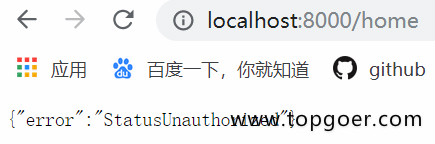
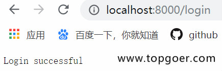
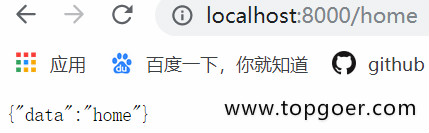

# Cookie练习

- 模拟实现权限验证中间件
    - 有2个路由，login和home
    - login用于设置cookie
    - home是访问查看信息的请求
    - 在请求home之前，先跑中间件代码，检验是否存在cookie
- 访问home，会显示错误，因为权限校验未通过









```go

package main

import (
   "github.com/gin-gonic/gin"
   "net/http"
)

func AuthMiddleWare() gin.HandlerFunc {
   return func(c *gin.Context) {
      // 获取客户端cookie并校验
      if cookie, err := c.Cookie("abc"); err == nil {
         if cookie == "123" {
            c.Next()
            return
         }
      }
      // 返回错误
      c.JSON(http.StatusUnauthorized, gin.H{"error": "err"})
      // 若验证不通过，不再调用后续的函数处理
      c.Abort()
      return
   }
}

func main() {
   // 1.创建路由
   r := gin.Default()
   r.GET("/login", func(c *gin.Context) {
      // 设置cookie
      c.SetCookie("abc", "123", 60, "/",
         "localhost", false, true)
      // 返回信息
      c.String(200, "Login success!")
   })
   r.GET("/home", AuthMiddleWare(), func(c *gin.Context) {
      c.JSON(200, gin.H{"data": "home"})
   })
   r.Run(":8000")
}
```

访问 /home 和 /login进行测试


---

这段代码使用 Gin 框架实现了**基于 Cookie 的简易身份认证系统**，通过中间件拦截请求并校验凭证。以下是逐层解析与技术要点：

---

### 一、代码核心逻辑解析
#### 1. **中间件定义：`AuthMiddleWare`**
```go
func AuthMiddleWare() gin.HandlerFunc {
    return func(c *gin.Context) {
        // 尝试获取名为 "abc" 的 Cookie
        if cookie, err := c.Cookie("abc"); err == nil {
            if cookie == "123" { // 校验 Cookie 值
                c.Next()    // 验证通过，放行后续处理
                return
            }
        }
        // 验证失败，返回 401 错误并终止流程
        c.JSON(http.StatusUnauthorized, gin.H{"error": "err"})
        c.Abort() // 强制终止后续处理链
    }
}
```
- **作用**：验证客户端请求是否携带有效 Cookie。
- **关键操作**：
  - **`c.Cookie("abc")`**：从请求头提取名为 `abc` 的 Cookie。
  - **`c.Next()`**：验证通过后，触发后续中间件或路由处理函数。
  - **`c.Abort()`**：验证失败时终止请求处理链，阻止后续逻辑执行。

#### 2. **路由注册与 Cookie 设置**
```go
func main() {
    r := gin.Default()
    // 登录接口：设置 Cookie
    r.GET("/login", func(c *gin.Context) {
        c.SetCookie("abc", "123", 60, "/", "localhost", false, true)
        c.String(200, "Login success!")
    })
    // 主页接口：绑定中间件
    r.GET("/home", AuthMiddleWare(), func(c *gin.Context) {
        c.JSON(200, gin.H{"data": "home"})
    })
    r.Run(":8000")
}
```
- **`/login` 路由**：设置一个有效期为 60 秒的 Cookie，参数说明：
  - **Secure: false**：允许 HTTP 传输（生产环境建议设为 `true` 以强制 HTTPS）。
  - **HttpOnly: true**：禁止 JavaScript 访问 Cookie，防止 XSS 攻击。
- **`/home` 路由**：通过 `AuthMiddleWare()` 注册中间件，仅允许携带有效 Cookie 的请求访问。

---

### 二、技术细节与执行流程
#### 1. **中间件执行顺序**
- **路由级中间件**：当请求匹配到 `/home` 时，先执行 `AuthMiddleWare`，再执行路由处理函数。
- **洋葱模型**：若中间件中调用 `c.Next()`，处理流程会进入后续中间件或路由函数，返回时继续执行中间件中 `c.Next()` 后的代码（此代码未涉及后处理逻辑）。

#### 2. **Cookie 验证流程**
1. **客户端访问 `/login`**：服务端设置 Cookie 并返回成功响应。
2. **客户端访问 `/home`**：浏览器自动携带 Cookie，中间件校验其存在性和值是否正确。
  - **验证通过**：调用 `c.Next()`，执行 `c.JSON(200, gin.H{"data": "home"})`。
  - **验证失败**：返回 `401 Unauthorized`，调用 `c.Abort()` 终止流程。

#### 3. **关键方法说明**
- **`c.SetCookie()`**：设置 Cookie 的参数（如有效期、作用域）需结合实际场景调整。
- **`c.Abort()` 与 `c.Next()` 的对比**：
  | 方法        | 作用                           | 使用场景                     |
  |-------------|--------------------------------|------------------------------|
  | `c.Next()`  | 传递控制权给后续处理逻辑       | 验证通过后放行请求           |
  | `c.Abort()` | 终止当前请求链                 | 验证失败或需立即响应客户端   |

---

### 三、安全性优化建议
1. **Cookie 安全增强**：
  - **Secure 属性**：生产环境应设为 `true`，仅通过 HTTPS 传输 Cookie。
  - **SameSite 属性**：添加 `SameSite=Lax` 或 `Strict`，防止 CSRF 攻击（需 Gin 版本支持）。
2. **敏感信息保护**：
  - **避免硬编码凭证**：示例中 Cookie 值 `123` 应改为动态生成的 Token（如 JWT）。
  - **加密存储**：对 Cookie 值进行加密（如 AES），避免明文暴露敏感数据。

---

### 四、扩展应用场景
1. **会话管理**：结合 Redis 存储 Session 数据，通过 Cookie 中的 Session ID 关联用户状态。
2. **多层级中间件**：在路由组上注册中间件，实现接口分类鉴权（如管理员与普通用户分离）。
3. **日志与监控**：在中间件中添加请求耗时统计、异常日志记录等功能。

---

### 五、请求测试示例
#### 1. 登录并获取 Cookie
```bash
curl -v http://localhost:8000/login
```
**响应头**包含：
```
Set-Cookie: abc=123; Path=/; Domain=localhost; Max-Age=60; HttpOnly
```

#### 2. 访问受保护路由（携带 Cookie）
```bash
curl -H "Cookie: abc=123" http://localhost:8000/home
```
**响应**：
```json
{"data": "home"}
```

#### 3. 访问受保护路由（未携带 Cookie）
```bash
curl http://localhost:8000/home
```
**响应**：
```json
{"error": "err"}
```

---

### 总结
这段代码展示了 Gin 框架中**中间件的链式调用机制**和**Cookie 身份验证**的基础实现，核心特点包括：
1. **中间件拦截**：通过路由级中间件实现权限校验。
2. **上下文控制**：`c.Next()` 与 `c.Abort()` 管理请求生命周期。
3. **Cookie 安全配置**：通过参数限制作用域与访问权限。

实际开发中需结合业务场景优化安全策略，并利用 Gin 的中间件生态系统（如 JWT 鉴权、请求日志）构建健壮的 Web 应用。


---

这段代码中的 `return` 在中间件逻辑中起到**控制函数执行流程**的作用，具体分为以下两种情况：

---

### 一、验证通过时的 `return`（Cookie 有效）
```go
if cookie == "123" {
    c.Next()  // 放行后续处理函数
    return    // 立即终止当前中间件函数的执行
}
```
- **作用**：  
  当 Cookie 校验通过时，调用 `c.Next()` 将请求传递给后续中间件或路由处理函数，随后通过 `return` **立即退出当前中间件函数**，避免执行后续的无关逻辑（如错误响应）。
- **必要性**：  
  若不使用 `return`，中间件函数会继续执行到最后的 `c.JSON` 和 `c.Abort()`，导致错误响应覆盖正确的处理结果。

---

### 二、验证失败时的 `return`（Cookie 无效）
```go
c.JSON(http.StatusUnauthorized, gin.H{"error": "err"})
c.Abort()  // 终止请求处理链
return     // 退出中间件函数
```
- **作用**：  
  在设置错误响应并调用 `c.Abort()` 终止请求后，通过 `return` **确保中间件函数立即退出**，防止后续代码干扰已完成的错误处理。
- **与 `c.Abort()` 的协同**：  
  `c.Abort()` 是 Gin 框架中**终止请求链**的方法，而 `return` 则是 Go 语言中**退出函数执行**的关键字。两者结合使用可彻底阻断逻辑（如避免其他中间件或路由处理函数被意外触发）。

---

### 三、对比 `return` 与 `c.Abort()` 的核心差异
| 操作         | 作用范围           | 适用场景                     | 是否必须搭配使用     |
|--------------|--------------------|------------------------------|----------------------|
| `return`     | 当前函数           | 控制函数内部流程             | 否（但推荐与逻辑匹配） |
| `c.Abort()`  | 整个请求处理链     | 全局终止请求（如权限校验失败） | 是（需配合 `return`） |

---

### 四、代码优化建议
1. **调整 `c.Next()` 的位置**：  
   建议将 `c.Next()` 放在 `defer` 中，确保即使中间件后续代码出现 panic 也能正常传递请求：
   ```go
   defer c.Next()
   ```
2. **明确错误信息**：  
   将 `"error": "err"` 改为具体描述（如 `"unauthorized: invalid cookie"`），便于客户端调试。

---

### 总结
代码中的 `return` 主要用于**控制中间件函数的执行路径**：
- 验证通过时，**及时退出函数**，避免污染正常响应；
- 验证失败时，**配合 `c.Abort()` 彻底终止请求**，确保错误处理逻辑的完整性。  
  这是 Gin 中间件设计中防止逻辑泄漏的常见模式。
