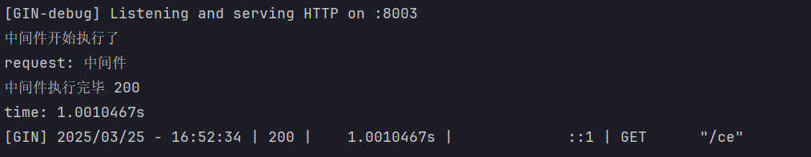

# Next()方法


在 Gin 框架中，`c.Next()` 方法是中间件机制的核心方法之一，它实现了中间件的**洋葱模型**（Onion Model），允许开发者在请求处理的不同阶段插入逻辑。以下是其核心原理和应用场景的详细解析：

---

### 一、`c.Next()` 的执行机制
#### 1. **洋葱模型与执行顺序**
`c.Next()` 的作用是将请求**传递到下一个中间件或路由处理函数**，形成链式调用。中间件的执行顺序分为两个阶段：
- **请求进入阶段**：中间件按注册顺序依次执行 `c.Next()` 前的逻辑。
- **响应返回阶段**：中间件按注册的逆序执行 `c.Next()` 后的逻辑。

**示例**：  
假设注册了中间件 `m1`、`m2` 和路由处理函数：
```go
func m1(c *gin.Context) {
    fmt.Println("m1 start")
    c.Next()
    fmt.Println("m1 end")
}

func m2(c *gin.Context) {
    fmt.Println("m2 start")
    c.Next()
    fmt.Println("m2 end")
}
```
执行顺序为：  
`m1 start → m2 start → 路由处理函数 → m2 end → m1 end`。

#### 2. **实现原理**
Gin 通过维护一个中间件函数链表实现洋葱模型：
- **调用 `c.Next()` 时**：框架会跳转到下一个中间件或路由处理函数。
- **所有中间件执行完毕后**：从最后一个中间件开始反向执行 `c.Next()` 后的代码。

---

### 二、`c.Next()` 的核心应用场景
#### 1. **日志记录**
在请求处理前后记录时间差，统计耗时：
```go
func Logger() gin.HandlerFunc {
    return func(c *gin.Context) {
        start := time.Now()
        c.Next() // 先执行后续逻辑
        latency := time.Since(start)
        log.Printf("耗时：%v", latency)
    }
}
```
**注意**：若将耗时计算放在 `c.Next()` 前，结果将不包含后续中间件的执行时间。

#### 2. **身份验证**
在请求到达业务逻辑前进行权限校验：
```go
func AuthMiddleware() gin.HandlerFunc {
    return func(c *gin.Context) {
        token := c.GetHeader("Authorization")
        if token == "" {
            c.AbortWithStatusJSON(401, gin.H{"error": "未授权"})
            return // 终止后续处理
        }
        c.Next() // 验证通过后继续执行
    }
}
```
若验证失败，调用 `c.Abort()` 终止流程，无需调用 `c.Next()`。

#### 3. **错误处理**
在中间件中捕获全局异常：
```go
func Recovery() gin.HandlerFunc {
    return func(c *gin.Context) {
        defer func() {
            if err := recover(); err != nil {
                c.JSON(500, gin.H{"error": "服务异常"})
            }
        }()
        c.Next() // 触发后续逻辑，异常可能在此阶段发生
    }
}
```

---

### 三、使用注意事项
#### 1. **`c.Next()` 的调用位置**
- **必须显式调用**：若中间件未调用 `c.Next()`，后续中间件和路由处理函数不会执行。
- **避免重复调用**：多次调用 `c.Next()` 会导致逻辑混乱（如重复执行后续中间件）。

#### 2. **与 `c.Abort()` 的配合**
- **终止流程**：调用 `c.Abort()` 后，后续中间件和路由处理函数不再执行，但当前中间件中 `c.Next()` 后的代码仍会执行。
- **典型场景**：身份验证失败时终止请求，但仍需记录日志或清理资源。

---

### 四、调试与优化建议
1. **调试中间件顺序**  
   通过打印日志确认中间件的执行顺序，确保洋葱模型的正确性。
2. **性能优化**
    - 避免在 `c.Next()` 前的逻辑中执行耗时操作（如数据库查询）。
    - 使用 `defer` 确保资源释放（如关闭文件句柄）。
3. **状态码获取时机**  
   需在 `c.Next()` 后获取响应状态码（`c.Writer.Status()`），否则可能得到默认值 `0`。

---

### 五、总结
`c.Next()` 是 Gin 中间件实现分层处理的核心方法，其设计特点包括：
- **链式执行**：通过洋葱模型实现请求与响应的双向拦截。
- **灵活控制**：支持前置逻辑（如参数校验）和后置逻辑（如日志记录）。
- **高效协作**：与 `c.Abort()`、`c.Set()` 等方法配合，构建完整的请求生命周期管理。

实际开发中，合理使用 `c.Next()` 可以显著提升代码的可维护性和扩展性，适用于鉴权、日志、性能监控等场景。


```go
package main

import (
    "fmt"
    "time"

    "github.com/gin-gonic/gin"
)

// 定义中间
func MiddleWare() gin.HandlerFunc {
    return func(c *gin.Context) {
        t := time.Now()
        fmt.Println("中间件开始执行了")
        // 设置变量到Context的key中，可以通过Get()取
        c.Set("request", "中间件")
        // 执行函数
        c.Next()
        // 中间件执行完后续的一些事情
        status := c.Writer.Status()
        fmt.Println("中间件执行完毕", status)
        t2 := time.Since(t)
        fmt.Println("time:", t2)
    }
}

func main() {
    // 1.创建路由
    // 默认使用了2个中间件Logger(), Recovery()
    r := gin.Default()
    // 注册中间件
    r.Use(MiddleWare())
    // {}为了代码规范
    {
        r.GET("/ce", func(c *gin.Context) {
            // 取值
            req, _ := c.Get("request")
            fmt.Println("request:", req)
            // 页面接收
            c.JSON(200, gin.H{"request": req})
        })

    }
    r.Run()
}
```



