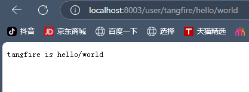

# API参数

- 可以通过Context的Param方法来获取API参数

- localhost:8000/xxx/zhangsan


```go
package main

import (
	"github.com/gin-gonic/gin"
	"net/http"
	"strings"
)

func main() {
	r := gin.Default()
	r.GET("/user/:name/*action", func(c *gin.Context) {
		name := c.Param("name")
		action := c.Param("action")
		// 截取
		action = strings.Trim(action, "/")
		c.String(http.StatusOK, name+" is "+action)
	})
	// 默认为监听8080端口
	r.Run(":8003")
}

```

输出结果：



这段代码使用 Gin 框架实现了一个动态路由处理的服务端程序，支持从 URL 路径中提取参数并组合响应。以下是代码的逐层解析和核心原理说明：

---

### **1. 路由定义与参数匹配**
#### **路由规则 `/user/:name/*action`**
- **动态参数 `:name`**  
  使用冒号 `:` 定义动态参数，捕获 URL 中对应位置的任意非空值（直到遇到 `/` 或路径结束）。例如：  
  `/user/john/...` → `name = "john"`。

- **通配符 `*action`**  
  使用星号 `*` 捕获路径剩余部分（包括 `/`），常用来处理多级路径。例如：  
  `/user/john/do/something` → `action = "/do/something"`。

#### **路由优先级**
Gin 的路由树（Trie 结构）会优先匹配静态路径，若未找到再匹配动态参数和通配符。例如：
- 若存在 `/user/john` 的静态路由，优先匹配它；
- 若无静态路由，则匹配 `/user/:name` 的动态规则。

---

### **2. 参数处理逻辑**
#### **参数提取**
- `name := c.Param("name")`  
  从路径参数中提取 `:name` 的值（如 `john`），底层通过遍历 `gin.Context.Params` 列表匹配键名获取。

- `action := c.Param("action")`  
  获取通配符 `*action` 的原始值（如 `/do/something`）。

#### **路径清理**
- `action = strings.Trim(action, "/")`  
  移除 `action` 首尾的 `/`，例如 `/do/something` → `do/something`，避免拼接字符串时出现多余斜杠。

---

### **3. 响应生成**
- `c.String(http.StatusOK, name + " is " + action)`  
  向客户端返回状态码 `200` 和纯文本响应，内容为 `name` 和 `action` 的组合（如 `john is do/something`）。  
  该方法自动设置 `Content-Type: text/plain`，并直接写入 HTTP 响应体。

---

### **4. 服务启动**
- `r.Run(":8000")`  
  启动 HTTP 服务，监听 `8000` 端口（默认端口为 `8080`）。Gin 底层调用 `http.ListenAndServe`，通过路由树和中间件链处理请求。

---

### **完整请求处理流程**
1. **请求到达**：客户端访问 `/user/john/do/something`。
2. **路由匹配**：Gin 路由树匹配到 `/user/:name/*action` 规则。
3. **参数提取**：`name = "john"`，`action = "/do/something"`。
4. **路径清理**：`action` 被修剪为 `do/something`。
5. **响应生成**：返回文本 `john is do/something`。

---

### **技术扩展**
- **路由树结构**  
  Gin 使用前缀树（Trie）存储路由规则，动态参数和通配符作为特殊节点插入树中，匹配时按优先级遍历。

- **性能优化**  
  路由树在启动时构建并缓存，匹配过程通过逐层路径片段快速定位，时间复杂度接近 O(路径深度)。

- **参数绑定进阶**  
  若需类型校验或自动绑定到结构体，可使用 `c.ShouldBindUri(&obj)`，通过标签 `uri:"name"` 映射参数。

---

通过此代码，可以快速实现 RESTful API 中动态路径参数的处理，适用于用户详情页、多级资源访问等场景。


