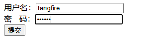
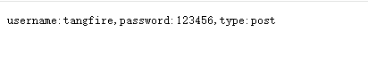

# 表单参数

- 表单传输为post请求，http常见的传输格式为四种：
  - application/json 
  - appication/x-www-form-urlencoded
  - application/xml
  - multipart/form-data
- 表单参数可以通过PostForm()方法获取，该方法默认解析的是x-www-form-urlencoded或from-data格式的参数

```html
<!DOCTYPE html>
<html lang="en">
<head>
    <meta charset="UTF-8">
    <meta name="viewport" content="width=device-width, initial-scale=1.0">
    <meta http-equiv="X-UA-Compatible" content="ie=edge">
    <title>Document</title>
</head>
<body>
<form action="http://localhost:8003/form" method="post" action="application/x-www-form-urlencoded">
    用户名：<input type="text" name="username" placeholder="请输入你的用户名">  <br>
    密&nbsp;&nbsp;&nbsp;码：<input type="password" name="userpassword" placeholder="请输入你的密码">  <br>
    <input type="submit" value="提交">
</form>
</body>
</html>

```

```go
package main

import (
	"fmt"
	"github.com/gin-gonic/gin"
	"net/http"
)

func main() {
	r := gin.Default()
	r.POST("/form", func(c *gin.Context) {
		types := c.DefaultPostForm("type", "post")
		username := c.PostForm("username")
		password := c.PostForm("userpassword")
		// c.String(http.StatusOK, fmt.Sprintf("username:%s,password:%s,type:%s", username, password, types))
		c.String(http.StatusOK, fmt.Sprintf("username:%s,password:%s,type:%s", username, password, types))
	})
	r.Run(":8003")
}

```

这段代码使用 Gin 框架实现了一个处理 **POST 表单提交**的 HTTP 服务端程序。以下是逐层解析与技术细节说明：

---

### **1. 核心功能概述**
代码实现了一个接收 `POST` 请求的接口 `/form`，**从表单数据中提取字段值**（用户名、密码、类型），并返回拼接后的字符串响应。以下是关键步骤：

---

### **2. 代码分步解析**
#### **(1) 初始化 Gin 实例**
```go
r := gin.Default()
```
- **作用**：创建一个默认的 Gin 引擎实例，**内置 Logger（请求日志）和 Recovery（异常恢复）中间件**。
- **扩展**：若需禁用默认中间件，可用 `gin.New()` 替代 `gin.Default()`。

---

#### **(2) 定义 POST 路由及处理函数**
```go
r.POST("/form", func(c *gin.Context) {
    // 参数解析逻辑
})
```
- **路由规则**：监听 `POST` 方法请求路径 `/form`，仅处理 `Content-Type: application/x-www-form-urlencoded` 或 `multipart/form-data` 的表单数据。
- **适用场景**：常用于 HTML 表单提交、文件上传等。

---

#### **(3) 解析表单参数**
```go
types := c.DefaultPostForm("type", "post")  // 获取字段值，若不存在则返回默认值"post"
username := c.PostForm("username")         // 获取字段值，若不存在则返回空字符串
password := c.PostForm("userpassword")
```
- **方法说明**：
  - **`c.DefaultPostForm(key, default)`**  
    提供默认值，避免空值导致的逻辑异常。
  - **`c.PostForm(key)`**  
    直接获取字段值，若无则返回空字符串。
- **参数来源**：表单数据（如 `<input name="username">`）或 URL 编码的请求体。

---

#### **(4) 构造响应**
```go
c.String(http.StatusOK, fmt.Sprintf("username:%s,password:%s,type:%s", username, password, types))
```
- **`c.String()` 方法**：  
  返回纯文本响应，状态码 `200`，内容为拼接的字符串（如 `username:admin,password:123456,type:post`）。
- **自动处理**：设置 `Content-Type: text/plain`。

---

#### **(5) 启动服务**
```go
r.Run()  // 默认监听 0.0.0.0:8080
```
- **端口指定**：若需自定义端口，可传入参数如 `r.Run(":8000")`。

---

### **3. 技术细节与扩展**
#### **(1) 表单数据安全**
- **明文传输风险**：示例中密码以明文形式传输，实际场景应使用 HTTPS 加密。
- **参数校验建议**：可结合 `binding:"required"` 标签或自定义逻辑校验字段必填性。

#### **(2) 参数获取方式对比**
| 方法                   | 行为                                                                 | 适用场景                  |
|------------------------|----------------------------------------------------------------------|-------------------------|
| `c.PostForm(key)`       | 直接获取值，不存在返回空字符串                                       | 必须字段                  |
| `c.DefaultPostForm(...)`| 获取值，不存在返回默认值                                             | 可选字段（需默认值）       |
| `c.GetPostForm(key)`    | 返回 `(value string, exists bool)`，可判断字段是否存在             | 需明确判断字段存在性的场景 |

---

### **4. 请求测试示例**
#### **使用 `curl` 模拟请求**
```bash
curl -X POST http://localhost:8080/form \
  -d "username=admin&userpassword=123456&type=submit"
```
**响应结果**：
```
username:admin,password:123456,type:submit
```

---

### **5. 潜在问题与优化**
- **字段命名不一致**：代码中密码字段名为 `userpassword`，而通常使用 `password`，需与前端表单保持一致。
- **重复代码**：注释中有一行重复的 `c.String(...)`，可能是调试残留，可删除。
- **性能优化**：频繁字符串拼接可使用 `strings.Builder` 或预定义模板。

---

### **总结**
这段代码是 Gin 框架处理表单提交的典型示例，涵盖了路由定义、参数解析和响应生成的核心流程。通过灵活使用 `PostForm` 系列方法，可高效处理表单数据，适用于登录、注册等基础功能开发。




