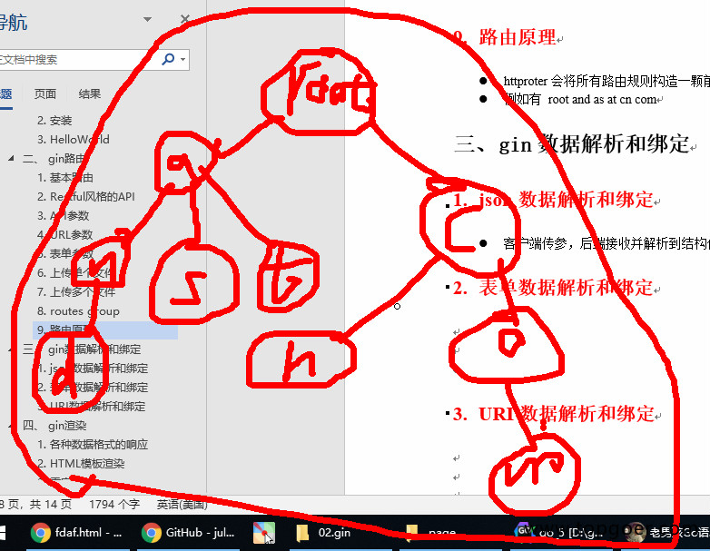

# 路由原理

http router会将所有路由规则构造一颗前缀树

例如有 root and as at cn com




Gin 框架的路由原理基于 **Radix Tree（基数树/压缩前缀树）** 的高效路径匹配机制，结合 HTTP 方法分离、动态参数支持和中间件链设计，实现了高性能与灵活性。以下是其核心原理的详细解析：

---

### 一、路由数据结构：Radix Tree 的优化
Gin 采用 **Radix Tree**（基数树）存储路由规则，相较于普通前缀树，Radix Tree 通过合并公共前缀节点减少内存占用，同时保持高效的插入和查询性能。
- **静态节点**：存储固定路径（如 `/user`），直接匹配请求路径。
- **动态节点**：以 `:param` 形式捕获动态参数（如 `/user/:id`），底层通过正则表达式匹配。
- **通配符节点**：以 `*` 捕获剩余路径（如 `/files/*filepath`），用于多级路径处理。

每个 **HTTP 方法（GET/POST 等）对应独立的 Radix Tree**，避免不同方法的路由冲突，提升匹配效率。

---

### 二、路由注册与匹配流程
#### 1. 路由注册
- **路径解析**：注册路由时，Gin 将路径拆分为片段（如 `/user/:id` 拆分为 `user` 和 `:id`），按片段逐层插入 Radix Tree。
- **优先级排序**：子节点按注册频率（优先级）排序，高频路径优先匹配，减少遍历时间。
- **路由组（RouterGroup）**：通过 `Group()` 创建共享前缀的路由组，支持统一中间件管理（如鉴权、日志）。

#### 2. 请求匹配流程
1. **定位方法树**：根据请求的 HTTP 方法（如 GET）选择对应的 Radix Tree。
2. **逐层路径匹配**：从根节点开始，按路径片段依次匹配静态节点、动态节点或通配符节点。
3. **参数提取**：动态参数（如 `:id`）和通配符（如 `*filepath`）的值会被提取并存入 `gin.Context` 中。
4. **处理链执行**：匹配成功后，按顺序执行绑定的中间件和最终处理函数。

---

### 三、关键特性与优化
#### 1. 动态参数与通配符
- **动态参数**：通过 `c.Param("id")` 获取，支持路径中的可变部分（如 `/user/123` → `id=123`）。
- **通配符**：捕获剩余路径（如 `/files/docs/123.txt` → `filepath=docs/123.txt`），适用于文件路径或嵌套资源。

#### 2. 中间件链
- **链式调用**：中间件和处理函数以链表形式存储，通过 `c.Next()` 控制执行顺序，支持前置/后置处理（如日志、鉴权）。
- **分组中间件**：路由组可绑定专属中间件，实现接口级别的逻辑复用。

#### 3. 性能优化
- **路由树预构建**：服务启动时完成所有路由的 Radix Tree 构建，运行时直接查找缓存结构。
- **零内存分配**：通过复用 `gin.Context` 对象和避免反射操作，减少 GC 压力。

---

### 四、示例与对比
#### 示例路由树结构
假设注册以下路由：
```go
r.GET("/user/:id", handler1)
r.GET("/user/profile", handler2)
r.POST("/user", handler3)
```
对应的 Radix Tree 结构如下：
```
GET Tree:
├── user 
│   ├── :id (动态节点) → handler1
│   └── profile (静态节点) → handler2

POST Tree:
└── user (静态节点) → handler3
```

#### 与标准库对比
| 特性               | Gin/Radix Tree       | 标准库 `net/http`    |
|--------------------|----------------------|---------------------|
| **路由匹配效率**   | O(路径深度)          | O(n)（遍历所有路由）|
| **动态参数支持**   | 原生支持             | 需手动解析           |
| **中间件扩展**     | 链式结构，灵活插入   | 需自行实现           |

---

### 五、总结
Gin 的路由原理通过 **Radix Tree 数据结构** 和 **HTTP 方法分离** 实现了高性能路径匹配，结合动态参数、中间件链和路由组设计，提供了灵活且高效的 Web 开发体验。其核心优势包括：
1. **极速匹配**：Radix Tree 的时间复杂度接近 O(路径深度)。
2. **内存高效**：压缩前缀树减少冗余节点。
3. **扩展性强**：中间件和路由组支持复杂业务逻辑分层。

如需深入实现细节，可参考源码中的 `routergroup.go` 和 `tree.go` 模块。


