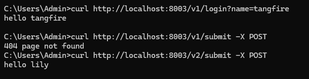

# routes group

- routes group是为了管理一些相同的URL

```go
package main

import (
   "github.com/gin-gonic/gin"
   "fmt"
)

// gin的helloWorld

func main() {
   // 1.创建路由
   // 默认使用了2个中间件Logger(), Recovery()
   r := gin.Default()
   // 路由组1 ，处理GET请求
   v1 := r.Group("/v1")
   // {} 是书写规范
   {
      v1.GET("/login", login)
      v1.GET("submit", submit)
   }
   v2 := r.Group("/v2")
   {
      v2.POST("/login", login)
      v2.POST("/submit", submit)
   }
   r.Run(":8000")
}

func login(c *gin.Context) {
   name := c.DefaultQuery("name", "jack")
   c.String(200, fmt.Sprintf("hello %s\n", name))
}

func submit(c *gin.Context) {
   name := c.DefaultQuery("name", "lily")
   c.String(200, fmt.Sprintf("hello %s\n", name))
}
```


这段代码使用 Gin 框架实现了一个支持多版本 API 的 Web 服务，核心是通过路由分组（Group）机制区分不同版本的接口。以下是分层次解析：

---

### **1. 整体架构与路由分组设计**
- **路由组 `/v1` 和 `/v2`**  
  通过 `r.Group()` 创建两个独立的路由组，分别对应 API 的 V1 和 V2 版本：
  ```go
  v1 := r.Group("/v1")  // V1 路由组
  v2 := r.Group("/v2")  // V2 路由组
  ```
    - **路径前缀**：组内所有路由自动继承前缀（如 `/v1/login` 实际路径为 `/v1/login`）。
    - **HTTP 方法差异化**：
        - **V1 使用 GET 方法**：`v1.GET(...)`，适合数据获取场景；
        - **V2 使用 POST 方法**：`v2.POST(...)`，适合数据提交场景。

---

### **2. 路由注册与处理函数**
#### **共享处理函数 `login` 和 `submit`**
- **函数复用**：  
  V1 和 V2 路由组共用 `login` 和 `submit` 函数，但通过 HTTP 方法区分行为：
  ```go
  // 处理函数从 URL 查询参数获取 name（GET/POST 均支持查询参数）
  func login(c *gin.Context) {
      name := c.DefaultQuery("name", "jack") // 默认值 "jack"
      c.String(200, fmt.Sprintf("hello %s\n", name))
  }
  ```

- **参数获取逻辑**：
    - **`c.DefaultQuery`**：从 URL 查询参数（`?name=value`）中读取值，若不存在则返回默认值；
    - **注意点**：
        - **GET 请求**：参数通过 URL 明文传输（如 `/v1/login?name=alice`）；
        - **POST 请求**：虽然代码中使用了 POST 方法，但参数仍通过 URL 查询传递（非请求体），这可能不符合常规设计（通常 POST 数据在请求体中）。

---

### **3. 服务启动**
```go
r.Run(":8003")  // 监听 8003 端口
```
- **默认中间件**：`gin.Default()` 包含 Logger（请求日志）和 Recovery（异常恢复）中间件。

---

### **4. 潜在问题与优化建议**
#### **(1) POST 方法的参数设计**
- **非常规用法**：  
  POST 请求通常期望参数通过请求体（Body）传递（如表单或 JSON），而非 URL 查询参数。当前代码中 POST 方法仍从查询参数读取 `name`，可能导致以下问题：
    - **安全性**：敏感数据（如密码）暴露在 URL 中；
    - **功能限制**：无法处理复杂数据结构（如嵌套 JSON）。

- **改进方案**：
  ```go
  // 对于 POST 请求，应使用 c.PostForm() 获取表单参数
  name := c.DefaultPostForm("name", "lily")
  ```

#### **(2) 路由分组扩展性**
- **中间件绑定**：  
  可为不同路由组绑定中间件（如 V2 添加身份验证）：
  ```go
  v2 := r.Group("/v2").Use(AuthMiddleware())
  ```

#### **(3) 版本控制规范**
- **Header 区分版本**：  
  更标准的 RESTful 设计会通过请求头（如 `Accept: application/vnd.myapi.v2+json`）区分版本，而非路径前缀。

---

### **5. 请求测试示例**
#### **V1 GET 请求**
```bash
curl http://localhost:8003/v1/login?name=alice
# 响应：hello alice

curl http://localhost:8003/v1/login
# 响应：hello jack（使用默认值）
```

#### **V2 POST 请求**
```bash
curl -X POST http://localhost:8003/v2/login?name=bob
# 响应：hello bob（仍从 URL 获取参数）
```

---

### **总结**
这段代码展示了 Gin 框架的**路由分组**和**多版本 API** 的实现方式，核心特点包括：
1. 通过 `Group()` 实现路径前缀隔离；
2. 同一路径支持不同 HTTP 方法（GET/POST）；
3. 查询参数的统一处理逻辑。

需注意 POST 方法的参数设计非常规，实际开发中应根据需求选择 `c.PostForm()` 或 `c.BindJSON()` 等方法处理请求体数据。


