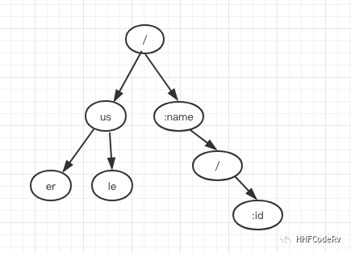

# gin 路由的实现剖析

gin 原理剖析说到这里，就完全进入 gin 的逻辑里面了。gin 已经拿到 http 请求了，第一件重要的事情肯定就是重写路由了，所以本节内容主要是分析 gin 的路由相关的内容。

其实 gin 的路由也不是完全自己写的，其实很重要的一部分代码是使用的开源的 julienschmidt/httprouter，当然 gin 也添加了部分自己独有的功能，如：routergroup。

# 什么是路由？

这个其实挺容易理解的，就是根据不同的 URL 找到对应的处理函数即可。

目前业界 Server 端 API 接口的设计方式一般是遵循 RESTful 风格的规范。当然我也见过某些大公司为了降低开发人员的心智负担和学习成本，接口完全不区分 GET/POST/DELETE 请求，完全靠接口的命名来表示。

举个简单的例子，如：”删除用户”

```go
RESTful:    DELETE  /user/hhf
No RESTful: GET     /deleteUser?name=hhf
```


这种 No RESTful 的方式，有的时候确实减少一些沟通问题和学习成本，但是只能内部使用了。这种不区分 GET/POST 的 Web 框架一般设计的会比较灵活，但是开发人员水平参差不齐，会导致出现很多“接口毒瘤”，等你发现的时候已经无可奈何了，如下面这些接口：

```go
GET /selectUserList?userIds=[1,2,3] -> 参数是否可以是数组？
GET /getStudentlist?skuIdCntMap={"200207366":1} -> 参数是否可以是字典？
```

这样的接口设计会导致开源的框架都是解析不了的，只能自己手动一层一层 decode 字符串，这里就不再详细铺开介绍了，等下一节说到 gin Bind 系列函数时再详细说一下。

继续回到上面 RESTful 风格的接口上面来，拿下面这些简单的请求来说：

```go
GET    /user/{userID} HTTP/1.1
POST   /user/{userID} HTTP/1.1
PUT    /user/{userID} HTTP/1.1
DELETE /user/{userID} HTTP/1.1
```

这是比较规范的 RESTful API设计，分别代表：

- 获取 userID 的用户信息
- 更新 userID 的用户信息（当然还有其 json body，没有写出来）
- 创建 userID 的用户（当然还有其 json body，没有写出来）
- 删除 userID 的用户

可以看到同样的 URI，不同的请求 Method，最终其他代表的要处理的事情也完全不一样。

看到这里你可以思考一下，假如让你来设计这个路由，要满足上面的这些功能，你会如何设计呢？


# gin 路由设计


## 如何设计不同的 Method ?

通过上面的介绍，已经知道 RESTful 是要区分方法的，不同的方法代表意义也完全不一样，gin 是如何实现这个的呢？

其实很简单，不同的方法就是一棵路由树，所以当 gin 注册路由的时候，会根据不同的 Method 分别注册不同的路由树。

```go
GET    /user/{userID} HTTP/1.1
POST   /user/{userID} HTTP/1.1
PUT    /user/{userID} HTTP/1.1
DELETE /user/{userID} HTTP/1.1
```

如这四个请求，分别会注册四颗路由树出来。

```go
func (engine *Engine) addRoute(method, path string, handlers HandlersChain) {
    //....
    root := engine.trees.get(method)
    if root == nil {
        root = new(node)
        root.fullPath = "/"
        engine.trees = append(engine.trees, methodTree{method: method, root: root})
    }
    root.addRoute(path, handlers)
    // ...
}
```


其实代码也很容易看懂，

- 拿到一个 method 方法时，去 trees slice 中遍历
- 如果 trees slice 存在这个 method, 则这个URL对应的 handler 直接添加到找到的路由树上
- 如果没有找到，则重新创建一颗新的方法树出来, 然后将 URL对应的 handler 添加到这个路由 树上

## gin 路由的注册过程

```go
func main() {
    r := gin.Default()
    r.GET("/ping", func(c *gin.Context) {
        c.JSON(200, gin.H{
            "message": "pong",
        })
    })
    r.Run() // listen and serve on 0.0.0.0:8080
}
```

这段简单的代码里，r.Get 就注册了一个路由 /ping 进入 GET tree 中。这是最普通的，也是最常用的注册方式。

不过上面这种写法，一般都是用来测试的，正常情况下我们会将 handler 拿到 Controller 层里面去，注册路由放在专门的 route 管理里面，这里就不再详细拓展，等后面具体说下 gin 的架构分层设计。


```go
//controller/somePost.go
func SomePostFunc(ctx *gin.Context) {
    // do something
    context.String(http.StatusOK, "some post done")
}
```

```go
// route.go
router.POST("/somePost", controller.SomePostFunc)
```


## 使用 RouteGroup


```go
v1 := router.Group("v1")
{
    v1.POST("login", func(context *gin.Context) {
        context.String(http.StatusOK, "v1 login")
    })
}
```

RouteGroup 是非常重要的功能，举个例子：一个完整的 server 服务，url 需要分为鉴权接口和非鉴权接口，就可以使用 RouteGroup 来实现。其实最常用的，还是用来区分接口的版本升级。这些操作, 最终都会在反应到gin的路由树上


# gin 路由的具体实现

```go
func main() {
    r := gin.Default()
    r.GET("/ping", func(c *gin.Context) {
        c.JSON(200, gin.H{
            "message": "pong",
        })
    })
    r.Run() // listen and serve on 0.0.0.0:8080
}
```

还是从这个简单的例子入手。我们只需要弄清楚下面三个问题即可：

- URL->ping 放在哪里了？
- handler-> 放在哪里了？
- URL 和 handler 是如何关联起来的？


## 1. GET/POST/DELETE/..的最终归宿

```go
func (group *RouterGroup) GET(relativePath string, handlers ...HandlerFunc) IRoutes {
   return group.handle(http.MethodGet, relativePath, handlers)
}
```

在调用POST, GET, HEAD等路由HTTP相关函数时, 会调用handle函数。handle 是 gin 路由的统一入口。

```go
// routergroup.go:L72-77
func (group *RouterGroup) handle(httpMethod, relativePath string, handlers HandlersChain) IRoutes {
    absolutePath := group.calculateAbsolutePath(relativePath)
    handlers = group.combineHandlers(handlers)
    group.engine.addRoute(httpMethod, absolutePath, handlers)
    return group.returnObj()
}
```

## 2. 生成路由树

下面考虑一个情况，假设有下面这样的路由，你会怎么设计这棵路由树？

```go
GET /abc 
GET /abd
GET /af
```

当然最简单最粗暴的就是每个字符串占用一个树的叶子节点，不过这种设计会带来的问题：占用内存会升高，我们看到 abc, abd, af 都是用共同的前缀的，如果能共用前缀的话，是可以省内存空间的。

gin 路由树是一棵前缀树. 我们前面说过 gin 的每种方法(POST, GET …)都有自己的一颗树，当然这个是根据你注册路由来的，并不是一上来把每种方式都注册一遍。gin 每棵路由大概是下面的样子




这个流程的代码太多，这里就不再贴出具体代码里，有兴趣的同学可以按照这个思路看下去即可。


## 3. handler 与 URL 关联

```go
type node struct {
    path      string
    indices   string
    wildChild bool
    nType     nodeType
    priority  uint32
    children  []*node // child nodes, at most 1 :param style node at the end of the array
    handlers  HandlersChain
    fullPath  string
}
```

node 是路由树的整体结构

- children 就是一颗树的叶子结点。每个路由的去掉前缀后，都被分布在这些 children 数组里
- path 就是当前叶子节点的最长的前缀
- handlers 里面存放的就是当前叶子节点对应的路由的处理函数

# 当收到客户端请求时，如何找到对应的路由的handler？

《gin 源码阅读(2) - http请求是如何流入gin的?》第二篇说到 net/http 非常重要的函数 ServeHTTP，当 server 收到请求时，必然会走到这个函数里。由于 gin 实现这个 ServeHTTP，所以流量就转入 gin 的逻辑里面。

```go
// gin.go:L439-443
func (engine *Engine) ServeHTTP(w http.ResponseWriter, req *http.Request) {
    c := engine.pool.Get().(*Context)
    c.writermem.reset(w)
    c.Request = req
    c.reset()

    engine.handleHTTPRequest(c)

    engine.pool.Put(c)
}
```

所以，当 gin 收到客户端的请求时, 第一件事就是去路由树里面去匹配对应的 URL，找到相关的路由, 拿到相关的处理函数。其实这个过程就是 handleHTTPRequest 要干的事情。

```go
func (engine *Engine) handleHTTPRequest(c *Context) {
    // ...
    t := engine.trees
    for i, tl := 0, len(t); i < tl; i++ {
        if t[i].method != httpMethod {
            continue
        }
        root := t[i].root
        // Find route in tree
        value := root.getValue(rPath, c.params, unescape)
        if value.params != nil {
            c.Params = *value.params
        }
        if value.handlers != nil {
            c.handlers = value.handlers
            c.fullPath = value.fullPath
            c.Next()
            c.writermem.WriteHeaderNow()
            return
        }
        if httpMethod != "CONNECT" && rPath != "/" {
            if value.tsr && engine.RedirectTrailingSlash {
                redirectTrailingSlash(c)
                return
            }
            if engine.RedirectFixedPath && redirectFixedPath(c, root, engine.RedirectFixedPath) {
                return
            }
        }
      break
    }
  // ...
}
```

从代码上看这个过程其实也很简单：

- 遍历所有的路由树，找到对应的方法的那棵树
- 匹配对应的路由
- 找到对应的 handler

