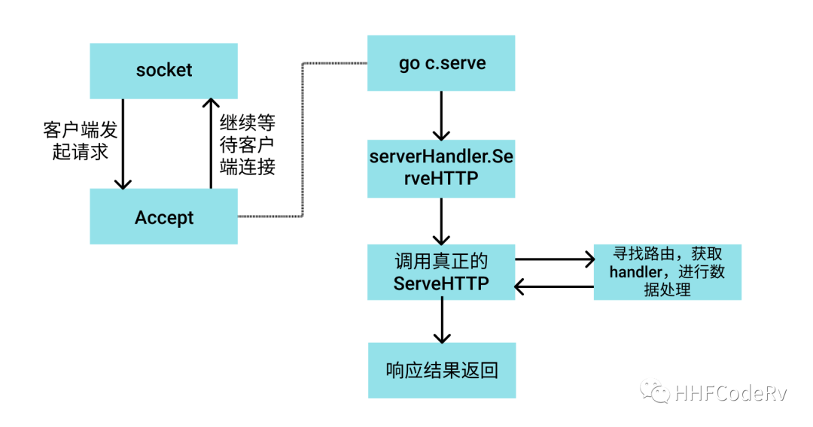

# http请求是如何流入gin的?


本篇文章是 gin 源码分析系列的第二篇，这篇文章我们主要弄清一个问题：一个请求通过 net/http 的 socket 接收到请求后, 是如何回到 gin 中处理逻辑的？

我们仍然以 net/http 的例子开始

```go
func main() {
    http.HandleFunc("/", func(w http.ResponseWriter, r *http.Request) {
        w.Write([]byte("Hello World"))
    })

    if err := http.ListenAndServe(":8000", nil); err != nil {
        fmt.Println("start http server fail:", err)
    }
}
```

这个例子中 http.HandleFunc 通过看源码，可以看到 URI “/“ 被注册到了 DefaultServeMux 上。

```go
func HandleFunc(pattern string, handler func(ResponseWriter, *Request)) {
   DefaultServeMux.HandleFunc(pattern, handler)
}
```

# net/http ServeHTTP 的作用

net/http 里面有个非常重要的 Handler interface。只有实现了这个方法才能请求的处理逻辑引入自己的处理流程中。

```go
// https://github.com/golang/go/blob/master/src/net/http/server.go#L86-L88
type Handler interface {
   ServeHTTP(ResponseWriter, *Request)
}
```

默认的 DefaultServeMux 就实现了这个 ServeHTTP

这个 request 的流转过程：

1. socket.accept 接收到客户端请求后，启动 go c.serve(connCtx) [net/http server.go:L3013]行，专门处理这次请求，server 继续等待客户端连接
2. 获取能处理这次请求的 handler -> serverHandler{c.server}.ServeHTTP(w, w.req) [net/http server.go:L1952]
3. 跳转到真正的 ServeHTTP 去匹配路由，获取 handler
4. 由于并没有自定义路由，于是使用的是 net/http 默认路由 [net/http server.go:L2880-2887]
5. 所以最终调用去 DefaultServeMux 匹配路由，输出返回对应的结果




# 探究 gin ServeHTTP 的调用链路


下面是 gin 的官方 demo, 仅仅几行代码，就启动了一个 echo server。

```go
package main

import "github.com/gin-gonic/gin"

func main() {
    r := gin.Default()
    r.GET("/ping", func(c *gin.Context) {
        c.JSON(200, gin.H{
            "message": "pong",
        })
    })
    r.Run() // listen and serve on 0.0.0.0:8080
}
```

这段代码的大概流程:

1. r := gin.Default() 初始化了相关的参数
2. 将路由 /ping 以及对应的 handler 注册到路由树中
3. 使用 r.Run() 启动 server


r.Run 的底层依然是 http.ListenAndServe

```go
func (engine *Engine) Run(addr ...string) (err error) {
    defer func() { debugPrintError(err) }()

    trustedCIDRs, err := engine.prepareTrustedCIDRs()
    if err != nil {
        return err
    }
    engine.trustedCIDRs = trustedCIDRs
    address := resolveAddress(addr)
    debugPrint("Listening and serving HTTP on %s\n", address)
    err = http.ListenAndServe(address, engine)
    return
}
```


所以 gin 建立 socket 的过程，accept 客户端请求的过程与 net/http 没有差别，会同样重复上面的过程。唯一有差别的位置就是在于获取 ServeHTTP 的位置

```go
func (sh serverHandler) ServeHTTP(rw ResponseWriter, req *Request) {
    handler := sh.srv.Handler
    if handler == nil {
        handler = DefaultServeMux
    }
    if req.RequestURI == "*" && req.Method == "OPTIONS" {
        handler = globalOptionsHandler{}
    }
    handler.ServeHTTP(rw, req)
}
```

由于 sh.srv.Handler 是 interface 类型，但是其真正的类型是 gin.Engine，根据 interace 的动态转发特性，最终会跳转到 gin.Engine.ServeHTTP 函数中。


# gin.ServeHTTP 的实现

```go
func (engine *Engine) ServeHTTP(w http.ResponseWriter, req *http.Request) {
    c := engine.pool.Get().(*Context)
    c.writermem.reset(w)
    c.Request = req
    c.reset()

    engine.handleHTTPRequest(c)

    engine.pool.Put(c)
}
```

至此，终于我们看到了 gin.ServeHTTP 的全貌了

1. 从 sync.pool 里面拿去一块内存
2. 对这块内存做初始化工作，防止数据污染
3. 处理请求 handleHTTPRequest
4. 请求处理完成后，把这块内存归还到 sync.pool 中

现在看起来这个实现很简单，其实不然，这才是 gin 能够处理数据的第一步，也仅仅将请求流转入 gin 的处理流程而已。

这里做个结论：通过上面的源码流程分析，我们知道 net/http.ServeHTTP 这个函数相当重要性, 主要有这个函数的存在, 才能将请求流转入目前 Go 的这些框架里面，同学们有兴趣的话，可以去看看 echo, iris, go-zero 等框架是如何实现 ServeHTTP 的。