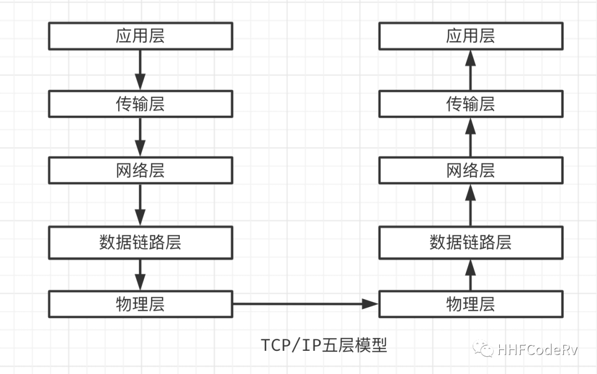
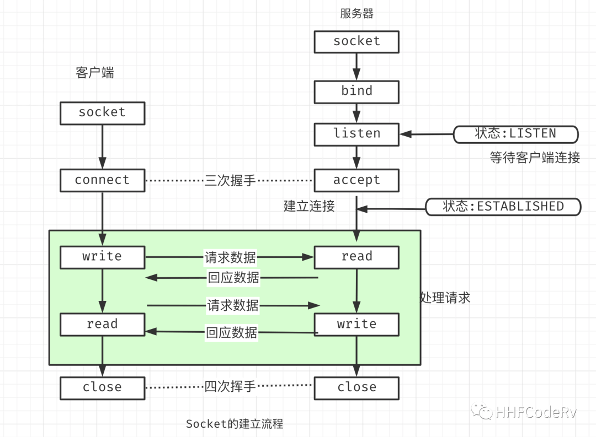

# gin 与 net/http 的关系

gin 是目前 Go 里面使用最广泛的框架之一了，弄清楚 gin 框架的原理，有助于我们更好的使用 gin。这个系列 gin 源码阅读会逐步讲明白 gin 的原理，欢迎关注后续文章。

## gin概览

想弄清楚 gin, 需要弄明白以下几个问题:

- request数据是如何流转的
- gin框架到底扮演了什么角色
- 请求从gin流入net/http, 最后又是如何回到gin中
- gin的context为何能承担起来复杂的需求
- gin的路由算法
- gin的中间件是什么
- gin的Engine具体是个什么东西
- net/http的requeset, response都提供了哪些有用的东西

从gin的官方第一个demo入手.

```go
package main

import "github.com/gin-gonic/gin"

func main() {
    r := gin.Default()
    r.GET("/ping", func(c *gin.Context) {
        c.JSON(200, gin.H{
          "message": "pong",
        })
    })
    r.Run() // listen and serve on 0.0.0.0:8080
}
```

r.Run()的源码:

```go
func (engine *Engine) Run(addr ...string) (err error) {
    defer func() { debugPrintError(err) }()

    address := resolveAddress(addr)
    debugPrint("Listening and serving HTTP on %s\n", address)
    err = http.ListenAndServe(address, engine)
    return
}
```

看到开始调用的是 http.ListenAndServe(address, engine), 这个函数是net/http的函数， 然后请求数据就在net/http开始流转.


## Request 数据是如何流转的

先不使用gin, 直接使用net/http来处理http请求

```go
func main() {
    http.HandleFunc("/", func(w http.ResponseWriter, r *http.Request) {
        w.Write([]byte("Hello World"))
    })

    if err := http.ListenAndServe(":8000", nil); err != nil {
        fmt.Println("start http server fail:", err)
    }
}
```

在浏览器中输入localhost:8000, 会看到Hello World. 下面利用这个简单demo看下request的流转流程.

## HTTP是如何建立起来的

简单的说一下http请求是如何建立起来的(需要有基本的网络基础, 可以找相关的书籍查看, 推荐看UNIX网络编程卷1：套接字联网API)




TCP/IP 五层模型



socket建立过程

在TCP/IP五层模型下, HTTP位于应用层, 需要有传输层来承载HTTP协议. 传输层比较常见的协议是TCP,UDP, SCTP等. 由于UDP不可靠, SCTP有自己特殊的运用场景, 所以一般情况下HTTP是由TCP协议承载的(可以使用wireshark抓包然后查看各层协议)

使用TCP协议的话, 就会涉及到TCP是如何建立起来的. 面试中能够常遇到的名词三次握手, 四次挥手就是在这里产生的. 具体的建立流程就不在陈述了, 大概流程就是图中左半边

所以说, 要想能够对客户端http请求进行回应的话, 就首先需要建立起来TCP连接, 也就是socket. 下面要看下net/http是如何建立起来socket?


## net/http 是如何建立 socket 的

从图上可以看出, 不管server代码如何封装, 都离不开bind,listen,accept这些函数. 就从上面这个简单的demo入手查看源码.

```go
func main() {
    http.HandleFunc("/", func(w http.ResponseWriter, r *http.Request) {
        w.Write([]byte("Hello World"))
    })

    if err := http.ListenAndServe(":8000", nil); err != nil {
        fmt.Println("start http server fail:", err)
    }
}

```

# 注册路由

```go
http.HandleFunc("/", func(w http.ResponseWriter, r *http.Request) {
    w.Write([]byte("Hello World"))
})
```

这段代码是在注册一个路由及这个路由的handler到DefaultServeMux中

```go
// server.go:L2366-2388
func (mux *ServeMux) Handle(pattern string, handler Handler) {
    mux.mu.Lock()
    defer mux.mu.Unlock()

    if pattern == "" {
        panic("http: invalid pattern")
    }
    if handler == nil {
        panic("http: nil handler")
    }
    if _, exist := mux.m[pattern]; exist {
        panic("http: multiple registrations for " + pattern)
    }

    if mux.m == nil {
        mux.m = make(map[string]muxEntry)
    }
    mux.m[pattern] = muxEntry{h: handler, pattern: pattern}

    if pattern[0] != '/' {
        mux.hosts = true
    }
}
```

可以看到这个路由注册太过简单了, 也就给gin, iris, echo等框架留下了扩展的空间, 后面详细说这个东西

## 服务监听及响应

上面路由已经注册到net/http了, 下面就该如何建立socket了, 以及最后又如何取到已经注册到的路由, 将正确的响应信息从handler中取出来返回给客户端


### 1. 创建socket

```go
if err := http.ListenAndServe(":8000", nil); err != nil {
    fmt.Println("start http server fail:", err)
}
```

```go
// net/http/server.go:L3002-3005
func ListenAndServe(addr string, handler Handler) error {
    server := &Server{Addr: addr, Handler: handler}
    return server.ListenAndServe()
}
```

```go
// net/http/server.go:L2752-2765
func (srv *Server) ListenAndServe() error {
    // ... 省略代码
    ln, err := net.Listen("tcp", addr) // <-----看这里listen
    if err != nil {
      return err
    }
    return srv.Serve(tcpKeepAliveListener{ln.(*net.TCPListener)})
}
```

### 2. Accept等待客户端链接

```go
// net/http/server.go:L2805-2853
func (srv *Server) Serve(l net.Listener) error {
    // ... 省略代码
    for {
      rw, e := l.Accept() // <----- 看这里accept
      if e != nil {
        select {
        case <-srv.getDoneChan():
          return ErrServerClosed
        default:
        }
        if ne, ok := e.(net.Error); ok && ne.Temporary() {
          if tempDelay == 0 {
            tempDelay = 5 * time.Millisecond
          } else {
            tempDelay *= 2
          }
          if max := 1 * time.Second; tempDelay > max {
            tempDelay = max
          }
          srv.logf("http: Accept error: %v; retrying in %v", e, tempDelay)
          time.Sleep(tempDelay)
          continue
        }
        return e
      }
      tempDelay = 0
      c := srv.newConn(rw)
      c.setState(c.rwc, StateNew) // before Serve can return
      go c.serve(ctx) // <--- 看这里
    }
}
```